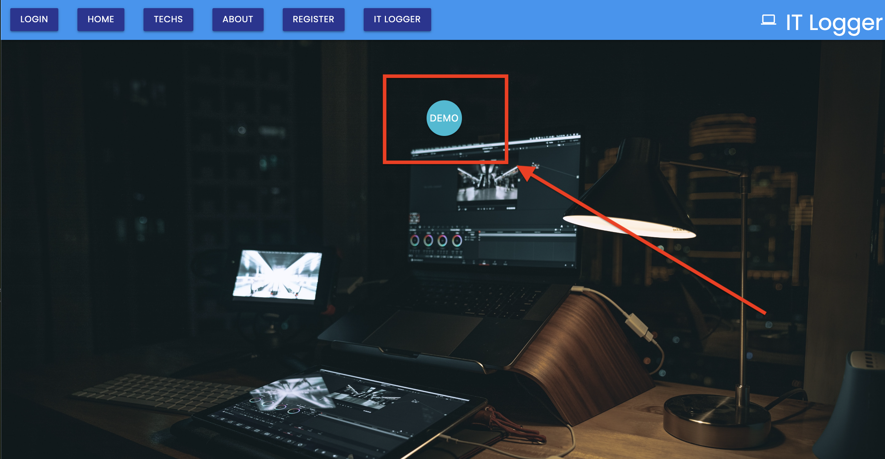

# IT-Logger

### Landing Page Image


An internal app ticketing system for IT Department's to trouble-shoot and communicate with techs using a system log entries and server up/down status. A tech can create a log and prioritize the issue. If the logs needs further details the has edit capabilities to make changes to the log. Once the issue is resolved a tech can delete the issue.

## Demo

[Deployed Link on Render](https://it-support.onrender.com/)

<small> **The app is hosted on render which can take 45-60 seconds to fully spin up sleep servers on first load</small>

<!-- Insert gif or link to demo -->

[Video]() coming soon...

## Author
[@GregPetropoulos](https://github.com/GregPetropoulos)

## Features
- Fullscreen mode
- Cross platform
- Mobile Responsive
- User Login / Registration 
- Prioritize a log to high
- Authenticated with JWT
- Authenticated users have their own private dashboard
- A user full CRUD operations of their logs
- Authenticated users can read only all other public logs
- A search filter is used to filter through all logs

Technologies:
- Frontend 
    
     
    - React 
    - Redux (Legacy)
    - MUI
    - CSS

- Backend
    
     
    - Node
    - Express
    - MongoDB
    - Mongoose
    - Postman

Testing


## Lessons Learned

**Challenges**
- Setting token to be checked for all request, adjusting store subscriber and when to loadTech()
- Multiple checkboxes with local state
- Materialize css for edit modal, had to use Material Select component
- Filter state vs filter DB

## Stretch Goals

- Error checking state and component
- Add charts for server and tech statistics
- Change StatusCards for server status to be manage by Redux
- Add Profile
- Tag a tech on a log
- Up time and Down time Warnings
- Upload an screenshot to the log
- Comment on a specific log similar to slack channels

## Documentation
[Resource Links](docs/doc-links.md)

<!-- ## Optimizations
What optimizations did you make in your code? E.g. refactors, performance improvements, accessibility -->

## Feedback
If you have any feedback, please reach out to gregpetropoulos@yahoo.com

## Usage/Examples

- On the landing page click on the demo button to login as an auth user


#### OR

- Go to the Register page and create a user

## Run Locally

Clone the project

```bash

# https
git clone https://github.com/GregPetropoulos/IT-Logger-App.git

# ssh
git clone git@github.com:GregPetropoulos/IT-Logger-App.git
```

### **To run the frontend and backend concurrently**
In the root folder

Install dependencies

```bash
  npm install
```

Start the both frontend and backend servers

```bash
  npm run dev
```

### **To run the backend only**
In the root folder

Install dependencies

```bash
  npm install
```

Start the server

```bash
  npm run server
```


### **To run the frontend only**
In the root folder

```bash
  cd client
```

Install dependencies

```bash
  npm install
```

Start the server

```bash
  npm run start
```

## API Reference
There are three core API categories and more detail can be found at the postman docs


- [Techs API](https://documenter.getpostman.com/view/18334011/2s9YR9YsYH)
```javascript
/api/techs
```
- [Logs API](https://documenter.getpostman.com/view/18334011/2s9YR9YsTv)
```javascript
/api/logs
```
- [Auth API](https://documenter.getpostman.com/view/18334011/2s9YR9YYSK)
```javascript
/api/auth
```

# Routes
- Protected routes for each tech.
- Each Tech can Create Read Updated Delete (CRUD) a log in their own private view. Once Ready a tech can add log to public interface
- Outside of a tech's log they can read only all other logs 
- Routes that are protected are by design of middleware for checking tokens and valid database id's

## MongoDB (NoSQL)

The database has two collections:

1. logs

2. techs

Logs are cross referenced by the techs id that created the log

The collections are created by the mongoose schema in the models folder. The log schema is associated to the tech schema by objectId.

```
const mongoose = require('mongoose');
const LogSchema = mongoose.Schema({
  // *Specific to a users logs
    tech:{
      type: mongoose.Schema.Types.ObjectId,
      ref: 'techs'
    },
```

***This allows the tech to have their own private view of the logs on their account.***

## Server Side Validation

The express-validator npm package was utilized to handle the backend validation for `Registration`, `Login`, and `Log routes`.
The validation comes after the auth middleware,

```
check('firstName','A first name is required').not.isEmpty(), (req,res)....
```

`.not` negates the result of the next validator in the chain and the `.isEmpty()` returns a boolean value for no errors within the result object
https://express-validator.github.io/docs/validation-result-api.html#isempty

## Authentication

A tech will have an authenticated route to login into after being registered. A middleware is used at login to check and verify the JSON Web Token. The tech.id is then stored in the payload to be used as reference of the logged in user.

### JSON Web Token (JWT)

The JSON Web Token is used to identify tech in the db by header, payload data, and signature
[JWT](https://jwt.io/)


## Environment Variables

To run this project, you will need to add the following environment variables to your ``.env file``, see the `.env-example` in the root folder
```bash
PORT=5000
NODE_ENV=development
MY_MONGODB_URI=ADD_YOUR_CONNECTION_STRING_HERE
MY_JWT_SECRET=ADD_YOUR_SECRET
SUPPRESS_NO_CONFIG_WARNING=false
```

## Deployment

To deploy this project on a platform such as render or heroku: 

```bash
  npm run deploy
```

## Contributing

Contributions are always welcome!

See [contribute](./docs/contribute.md) for ways to get started.

Please adhere to this project's `code of conduct`.


# Hi, I'm Greg Petropoulos! 👋

## 🚀 About Me
I am a React/React-Native Front End Developer and enjoy building applications with engaging UI/UX and robust backend API's with Node.js


## 🛠 Skills
React, React Native, Javascript, HTML, CSS, Node, Express


## 🔗 Links
[](https://gregpetropoulos.dev/)
[](www.linkedin.com/in/greg-petropoulos)
[](https://twitter.com/GregoriosPetro1)


## Other Common Github Profile Sections
👩‍💻 I'm currently working on React migration to React Native code base

🧠 I'm currently learning Cypress testing strategy and Next.js

👯‍♀️ I'm looking to collaborate on open source Veterans Health apps

💬 Ask me about anything frontend

📫 How to reach me gregpetropoulos@yahoo.com


⚡️ Fun fact...I found a dinosaur fossil that remains in the [Las Vegas Natural History Museum](https://www.lvnhm.org/).


<!-- ## Appendix

Any additional information goes here

#### add(num1, num2)

Takes two numbers and returns the sum.

## FAQ

#### Question 1

Answer 1

#### Question 2

Answer 2 -->

<!-- ```javascript
import Component from 'my-project'

function App() {
  return <Component />
}
``` -->

<!-- ## Used By

This project is used by the following companies:
- Company 1
- Company 2 -->

<!-- ## Acknowledgements -->

 <!-- - [Awesome Readme Templates](https://awesomeopensource.com/project/elangosundar/awesome-README-templates)
 - [Awesome README](https://github.com/matiassingers/awesome-readme)
 - [How to write a Good readme](https://bulldogjob.com/news/449-how-to-write-a-good-readme-for-your-github-project) -->

