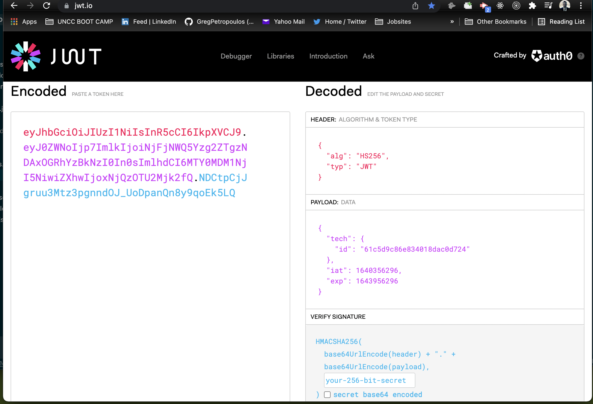

# IT Logger
### [Deployed](https://it-loggerv1.herokuapp.com/)


### Live Demo
https://user-images.githubusercontent.com/68525155/155793712-7147cef7-02c7-4439-bf4e-e9c87cee094e.mp4


## Table of Contents
- [Intro](#intro)
- [Routes](#routes)
- [MongoDB](#mongodb-nosql)
- [Authentication](#authentication)
- [JSON WEB TOKEN](#json-web-token-jwt)
- [Challenges](#challenges)
- [Stretch Goals](#stretch-goals)
- [Links](#links)
- [Deployed](#deployed)
- [Install](#install)


## Intro

Internal app for IT Department to trouble-shoot and communicate with a system log that can be set to alert for high priority issues. Authenticated users can see all the incoming logs and have their own dashboard of logs. Each user can read and filter all logs and only create, add, delete, and edit their own log.

## Routes

- Protected from each tech. 
- Each Tech can CRUD a log in their own private view. Once Ready a tech can add log to public interface
- A tech can not look at another techs logs
- Only logs shown on public will be seen by others
- Routes that are protected are by design of middleware

## MongoDB (NoSQL)

The database has two collections:

1. logs

2. techs

The collections are created by the mongoose schema in the models folder. The log schema is associated to the tech schema by objectId.

```
const mongoose = require('mongoose');
const LogSchema = mongoose.Schema({
  // *Specific to a users logs
    tech:{
      type: mongoose.Schema.Types.ObjectId, 
      ref: 'techs' 
      type: mongoose.Schema.Types.ObjectId,
      ref: 'techs'
    },
  ```
 This allows the tech to have their own private view of the logs on their account. 
```

This allows the tech to have their own private view of the logs on their account.

## Validation

The express-validator npm package was utilized to handle the backend validation for `Registration`, `Login`, and `Log routes`.
The validation comes after the auth middleware,
``` 

```
check('firstName','A first name is required').not.isEmpty(), (req,res)....
```

`.not` negates the result of the next validator in the chain and the `.isEmpty()` returns a boolean value for no errors within the result object
https://express-validator.github.io/docs/validation-result-api.html#isempty

## Authentication
A tech will have an authenticated route to login into after being registered. A middleware is used at login to check and verify the JSON Web Token. The tech.id is then stored in the payload to be used as reference of the logged in user. 

A tech will have an authenticated route to login into after being registered. A middleware is used at login to check and verify the JSON Web Token. The tech.id is then stored in the payload to be used as reference of the logged in user.

### JSON Web Token (JWT)



The JSON Web Token is used to identify the payload data
https://jwt.io/

## Challenges
- Setting token to be checked for all request, adjusting store subscriber and when to loadTech()

- Setting token to be checked for all request, adjusting store subscriber and when to loadTech()
- Multiple checkboxes with local state
- Filter state vs filter DB

## Stretch Goals

- Error checking state and component
- Add charts for server and tech statistics
- Change StatusCards for server status to be manage by Redux
- Add Profile Icons
- Tag a tech on a log
- Upload an screenshot to the log
- Comment on a specific log similar to slack channels

## Links
- [JWT](https://jwt.io/)
- [Deployed](https://it-loggerv1.herokuapp.com/)
- [MongoDB](https://www.mongodb.com/)
- [Express](http://expressjs.com/)
- [Redux](https://redux.js.org/)
- [React](https://reactjs.org/)
- [Node.js](https://nodejs.org/en/)
- [Materialize CSS](https://reactjs.org/)
- [Mongoose](https://mongoosejs.com/)


## Install 
Once you have cloned the repo you will need to set your own keys to run the app
- MongoURI
- jwtSecret